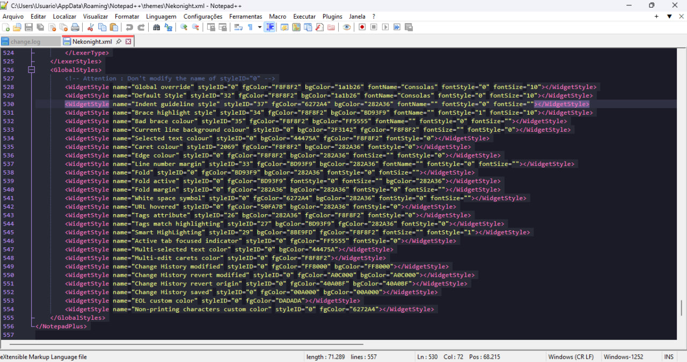

# notepad-plus-plus

Your favorite theme in notepad plus plus



## Installation 

If you are a git user, you can install the theme and keep up to date by cloning the repo:

```shell
git clone https://github.com/neko-night/notepad-plus-plus
```

#### Activating theme

1.  Go to `%AppData%\Notepad++\themes` (`%AppData%` is platform dependent environment variable. Open a Command Prompt and execute `echo %AppData%`);
2.  Place [`Nekonight.xml`](https://raw.githubusercontent.com/neko-night/notepad-plus-plus/main/Nekonight.xml) inside that folder;
3.  Restart Notepad++;
4.  Nekonight will be available in `Settings > Style Configurator`. 

## 👏 Acknowledgements

* [dracula](https://draculatheme.com/notepad-plus-plus) thanks for the base 


